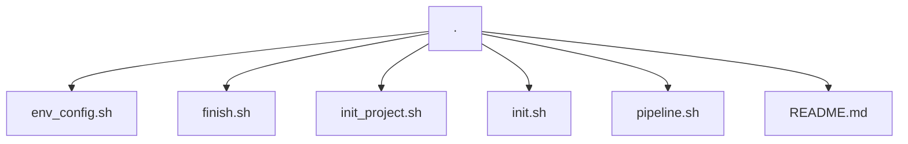

# ZG-Hero Linux: Automação com Alias e Shell Scripts

## Descrição

Este projeto tem como objetivo automatizar tarefas diárias utilizando scripts de shell e alias. O ambiente é configurado para criar e gerenciar projetos, controlar branches de features e implementar mini pipeline de integração contínua (CI) com cron jobs. Um script de configuração é fornecido para garantir que todas as dependências, aliases e crons sejam configurados automaticamente.

## Funcionalidades

### Task 1: Alias para Inicializar Projetos ACZG

**Alias** : `aczginitproj`
- Cria uma pasta para o projeto em um caminho especificado.
- Inicializa um repositório Git na pasta do projeto.
- Adiciona um arquivo `README.md` com o nome do projeto e faz o primeiro commit no Git.

### Task 2: Aliases para Gerenciamento de Branches

#### **Alias** : `aczginit`
- Mostra o status do repositório Git.
- Cria uma nova branch com o padrão `feat-$nomeEntrega`.
- Lista todas as branches locais e remotas.

#### **Alias** : `aczgfinish`
- Faz o checkout na branch `master`.
- Realiza o merge da branch da feature na `master`.
- Deleta a branch da feature localmente e remotamente.

### Task 3: Mini Pipeline de Continuous Integration (CI)

**Alias** : `pipeline.sh`
- Define cron jobs para automatizar a execução de testes unitários de projetos Gradle, armazenar logs e enviar alertas em caso de sucesso ou falha.
- O cron job também pode ser configurado para realizar compilação e execução de projetos.

### Task 4: Alias para Monitorar Logs

**Alias** : `aczglog`
- Exibe no terminal logs relacionados à execução dos testes da mini pipeline de CI.

### Task 5: Script de Configuração do Ambiente

**Script** : `configurarAmbiente.sh`
- Configura todos os aliases, scripts e cron jobs automaticamente.
- Após rodar o script, a máquina estará pronta para executar os comandos do projeto sem necessidade de configuração manual.

## Como Utilizar

Após clonar o repositório Execute o seguinte comando para configurar o ambiente automaticamente:

```bash
./env_config.sh
```

 Esse comando irá:
- Registrar os aliases no arquivo .bash_aliases.
- Copiar os scripts para um diretório padrão.

#### Verifique a existência da seguinte linha de código em seu arquivo `.bashrc` :

```bash
    if [ -f ~/.bash_aliases ]; then
        . ~/.bash_aliases
    fi
```

#### Após isso os aliases estarão prontos para serem utilizados

## Estrutura do projeto



## Requisitos
 - Sistema Operacional: Linux
 - Ferramentas: Git, Bash, Cron, Gradle (opcional)

 <br>

 ***Desenvolvido por Thales de Paula Martins***